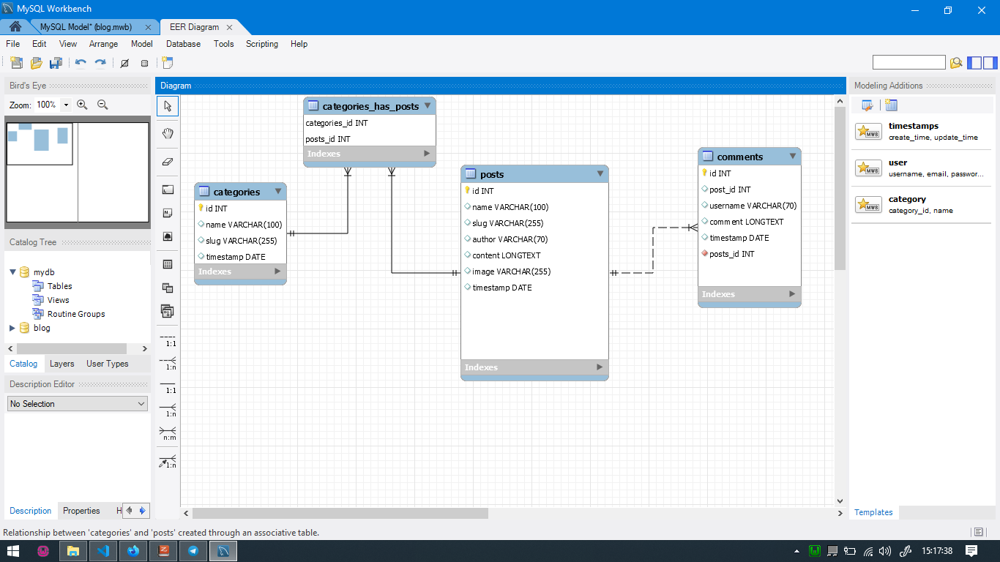

# Blog project
In this repo I show you how I made a simple blog with the php framework,Laravel .Go to [website](https://google.com
"Go to website")

## Database structure
### Tables
I need to store posts comments categories. So there are my tables

* posts
* categories
* comments

About relations there is a '__many to many__' relashionship between categories and posts and '__one to many__' between comments and posts


This is the deployment code of first migration

```sql
-- MySQL Script generated by MySQL Workbench
-- Wed Sep  8 15:21:10 2021
-- Model: New Model    Version: 1.0
-- MySQL Workbench Forward Engineering

SET @OLD_UNIQUE_CHECKS=@@UNIQUE_CHECKS, UNIQUE_CHECKS=0;
SET @OLD_FOREIGN_KEY_CHECKS=@@FOREIGN_KEY_CHECKS, FOREIGN_KEY_CHECKS=0;
SET @OLD_SQL_MODE=@@SQL_MODE, SQL_MODE='ONLY_FULL_GROUP_BY,STRICT_TRANS_TABLES,NO_ZERO_IN_DATE,NO_ZERO_DATE,ERROR_FOR_DIVISION_BY_ZERO,NO_ENGINE_SUBSTITUTION';

-- -----------------------------------------------------
-- Schema mydb
-- -----------------------------------------------------
-- -----------------------------------------------------
-- Schema blog
-- -----------------------------------------------------

-- -----------------------------------------------------
-- Schema blog
-- -----------------------------------------------------
CREATE SCHEMA IF NOT EXISTS `blog` ;
USE `blog` ;

-- -----------------------------------------------------
-- Table `blog`.`posts`
-- -----------------------------------------------------
CREATE TABLE IF NOT EXISTS `blog`.`posts` (
  `id` INT NOT NULL AUTO_INCREMENT,
  `name` VARCHAR(100) NULL,
  `slug` VARCHAR(255) NULL,
  `author` VARCHAR(70) NULL,
  `content` LONGTEXT NULL,
  `image` VARCHAR(255) NULL,
  `timestamp` DATE NULL,
  PRIMARY KEY (`id`))
ENGINE = InnoDB;


-- -----------------------------------------------------
-- Table `blog`.`categories`
-- -----------------------------------------------------
CREATE TABLE IF NOT EXISTS `blog`.`categories` (
  `id` INT NOT NULL AUTO_INCREMENT,
  `name` VARCHAR(100) NULL,
  `slug` VARCHAR(255) NULL,
  `timestamp` DATE NULL,
  PRIMARY KEY (`id`))
ENGINE = InnoDB;


-- -----------------------------------------------------
-- Table `blog`.`comments`
-- -----------------------------------------------------
CREATE TABLE IF NOT EXISTS `blog`.`comments` (
  `id` INT NOT NULL AUTO_INCREMENT,
  `post_id` INT NULL,
  `username` VARCHAR(70) NULL,
  `comment` LONGTEXT NULL,
  `timestamp` DATE NULL,
  `posts_id` INT NOT NULL,
  PRIMARY KEY (`id`),
  CONSTRAINT `fk_comments_posts1`
    FOREIGN KEY (`posts_id`)
    REFERENCES `blog`.`posts` (`id`)
    ON DELETE NO ACTION
    ON UPDATE NO ACTION)
ENGINE = InnoDB;

CREATE INDEX `fk_comments_posts1_idx` ON `blog`.`comments` (`posts_id` ASC) VISIBLE;


-- -----------------------------------------------------
-- Table `blog`.`categories_has_posts`
-- -----------------------------------------------------
CREATE TABLE IF NOT EXISTS `blog`.`categories_has_posts` (
  `categories_id` INT NOT NULL,
  `posts_id` INT NOT NULL,
  PRIMARY KEY (`categories_id`, `posts_id`),
  CONSTRAINT `fk_categories_has_posts_categories1`
    FOREIGN KEY (`categories_id`)
    REFERENCES `blog`.`categories` (`id`)
    ON DELETE NO ACTION
    ON UPDATE NO ACTION,
  CONSTRAINT `fk_categories_has_posts_posts1`
    FOREIGN KEY (`posts_id`)
    REFERENCES `blog`.`posts` (`id`)
    ON DELETE NO ACTION
    ON UPDATE NO ACTION)
ENGINE = InnoDB;

CREATE INDEX `fk_categories_has_posts_posts1_idx` ON `blog`.`categories_has_posts` (`posts_id` ASC) VISIBLE;

CREATE INDEX `fk_categories_has_posts_categories1_idx` ON `blog`.`categories_has_posts` (`categories_id` ASC) VISIBLE;


SET SQL_MODE=@OLD_SQL_MODE;
SET FOREIGN_KEY_CHECKS=@OLD_FOREIGN_KEY_CHECKS;
SET UNIQUE_CHECKS=@OLD_UNIQUE_CHECKS;

```

```php
<?php

namespace App\Http\Controllers;

use Illuminate\Http\Request;
use Illuminate\Support\Facades\Storage;
use Illuminate\Support\Facades\DB;
use Illuminate\Support\Str;
use App\Models\Category;
use App\Models\Comment;
use App\Models\Post;

class PostController extends Controller
{
    public function index()
    {
        //retrive posts with categories
        $recent_posts = Post::orderByDesc('created_at')->skip(3)->take(5)->get();
        if (request()->category) {
            $post = Post::with('categories')->whereHas('categories', function ($q) {
                $q->where('slug', request()->category);
            })->paginate(3);
            return view('welcome', ['posts' => $post, 'recent_posts' => $recent_posts]);
        }
        $posts = Post::orderByDesc('created_at')->paginate(3);
        return view('welcome', ['posts' => $posts, 'recent_posts' => $recent_posts]);
    }

    public function show($slug)
    {
        // take the post corresponding to the $slug
        $post = Post::where('slug', $slug)->get();
        $recent_posts = Post::orderByDesc('created_at')->skip(3)->take(5)->get();
        return view('blog', ['single' => $post, 'recent_posts' => $recent_posts]);
    }


    public function store(Request $request)
    {
        //validate form information
        $validated = $request->validate([
            'author' => 'required',
            'name' => 'required',
            'content' => 'required',
            'image' => 'image|required'
        ]);
        //create the post slug
        $validated['slug'] = Str::slug($validated['name'], '-');
        //store the image's path
        $path = $request->file('image')->store('avatars');
        $validated['image'] = $path;
        //create the post
        $post = Post::create($validated);
        $id = $post->id;
        // add category directly in the category_post table
        if ($request->category_id) {
            DB::table('category_post')->insert([
                'category_id' => $request->category_id,
                'post_id' => $id
            ]);
        }
        //return back with flash data
        $request->session()->flash('success', 'Post created successfully!');
        return back();
    }

    public function search()
    {
        $recent_posts = Post::orderByDesc('created_at')->skip(3)->take(5)->get();
        //retrive the q input and search it in content or title of all posts
        $q = request()->q;
        $post = Post::where('name', 'like', "%$q%")->orWhere('content', 'like', "%$q%")->get();
        return view('welcome', ['posts' => $post, 'recent_posts' => $recent_posts]);
    }

    public function store_comment(Request $request)
    {
        $validated = $request->validate([
            'username' => 'required',
            'comment' => 'required',
            'post_id' => 'required'
        ]);
        //validate the form informations and create a comment
        Comment::create($validated);
        //return back with flash data
        $request->session()->flash('success', 'Comment posted successfully!');
        return back();
    }
}

```

